<p align="center">
  
</p>

<h1 align="center">Smritive</h1>

<p align="center">
  <em>Preserve and share your story memories.</em>
</p>

<p align="center">
  
  
  
  
  
  
</p>

---

## Overview

Smritive is an Android app for sharing photo-stories with optional location tagging, built on top of the public [Dicoding Story API](https://story-api.dicoding.dev/v1). It was created as a *Dicoding Intermediate Flutter* class submission, but engineered to a production-quality bar — feature-first architecture, hand-authored launcher icons and animated splash, two distinguishable build flavors, and full English/Bahasa Indonesia localization.

**The problem it solves.** Ordinary photo apps lose the *context* of a memory — where it was taken, what was happening, what someone wanted to remember. Smritive pairs each photo with a short description and (in the paid variant) a precise map location, turning a casual photo into a *preserved memory* you can revisit and share.

<p align="center">
  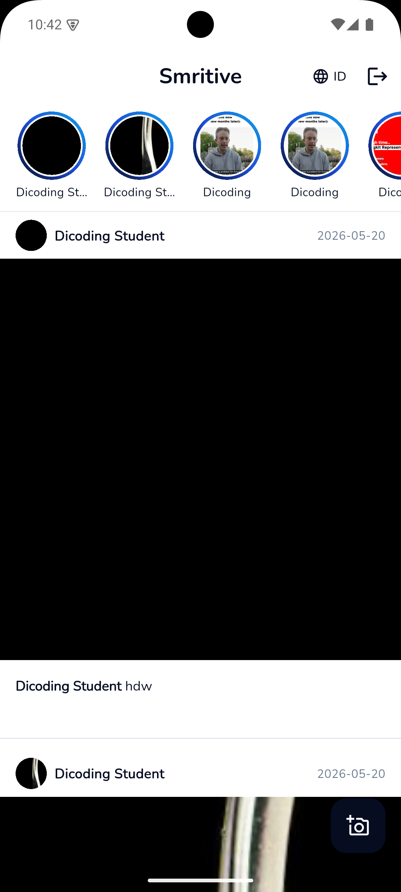
</p>

---

## Why "Smritive"?

> **Smritive** = Sanskrit *Smriti* (स्मृति, "that which is remembered") + English *-tive*.

The suffix `-tive` (as in *creative*, *native*) turns the noun into something *of the act of remembering*. Smritive is framed as an active way to **preserve memories**, not a passive bucket for photos.

---

## Highlights

- **Auth-gated routing** with persisted session via `SharedPreferences`.
- **Paginated story feed** with pull-to-refresh and infinite scroll.
- **Photo upload** with camera/gallery picker and a 1 MB validation gate.
- **Map-backed location picker** (paid flavor) using OpenStreetMap tiles.
- **Reverse geocoding** for human-readable addresses via Nominatim — no API key required.
- **English + Bahasa Indonesia**, user-toggleable independent of system locale, persisted across launches.
- **Two distinguishable build flavors** (Free / Paid) installable side-by-side.
- **Hand-authored launcher icons** + **animated Flutter splash**, no codegen packages.

---

## Screenshots

The screens below look identical across both flavors.

| Splash | Login | Register |
|:---:|:---:|:---:|
| 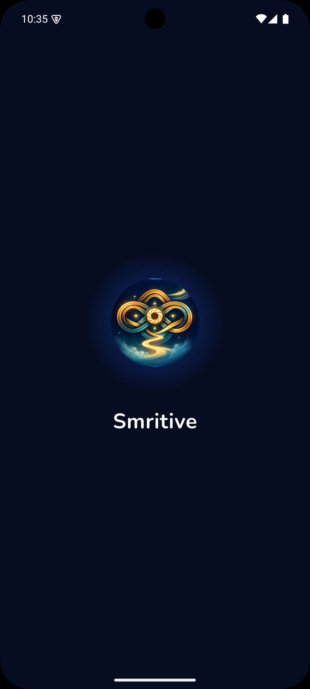 | 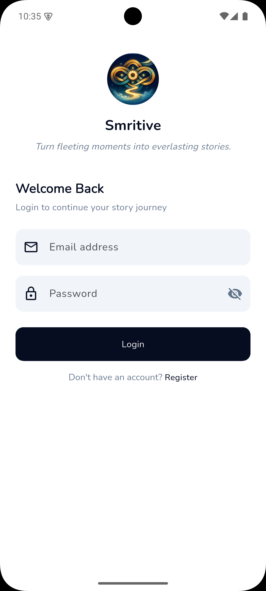 | 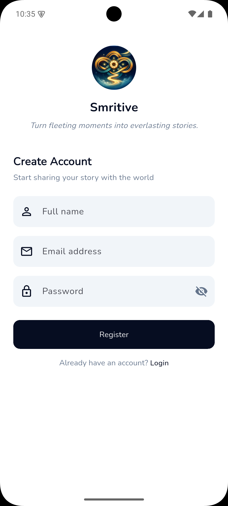 |

| Home / Feed | Story Detail |
|:---:|:---:|
|  | 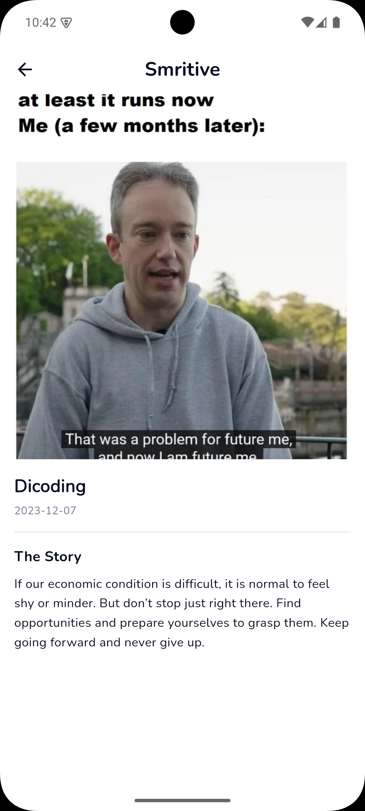 |

---

## Localization

Smritive ships in **English** and **Bahasa Indonesia**. The active language is controlled by an in-app toggle — it is **not** tied to the system locale, and the choice is persisted via `SharedPreferences` so it survives app restarts.

All user-facing strings live in `lib/l10n/app_{en,id}.arb` and are accessed through generated `AppLocalizations` (configured by `l10n.yaml`). Switching languages reactively rebuilds `MaterialApp.router` through `LocaleProvider`.

The same screens in both supported languages:

| English | Bahasa Indonesia |
|:---:|:---:|
|  | 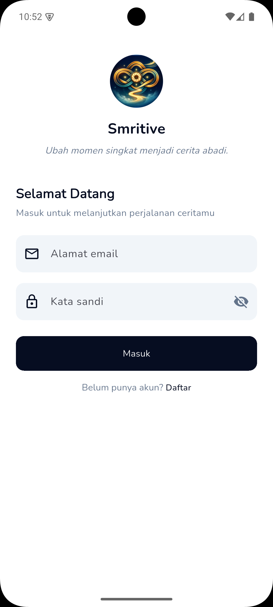 |
|  | 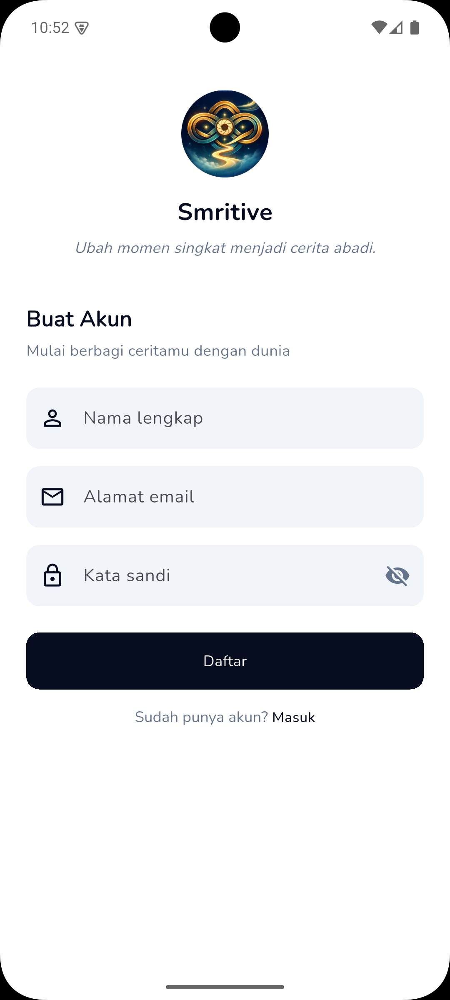 |
| 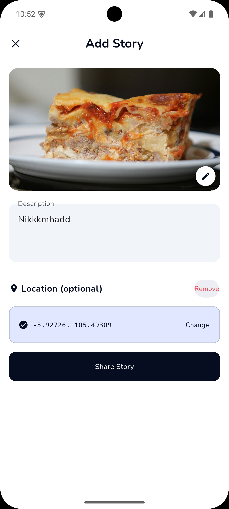 | 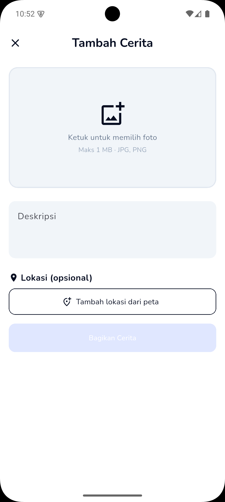 |

---

## Build Flavors

Smritive ships as **two distinct Android builds** that install side-by-side. They share the same codebase; the difference is one feature (location tagging) plus distinguishing branding.

<p align="center">
  
</p>

| Capability | Free | Paid |
|:---|:---:|:---:|
| Browse paginated story feed | ✓ | ✓ |
| View story details | ✓ | ✓ |
| Post a story (photo + description) | ✓ | ✓ |
| Attach map location to a story | — | ✓ |
| Launcher icon | Muted | Full-colour |
| App name on the launcher | Smritive Free | Smritive |
| Application ID | `com.example.smritive.free` | `com.example.smritive` |

### Free flavor

The Add Story flow on the free build — no location field, no map.

| Empty | Filled |
|:---:|:---:|
| 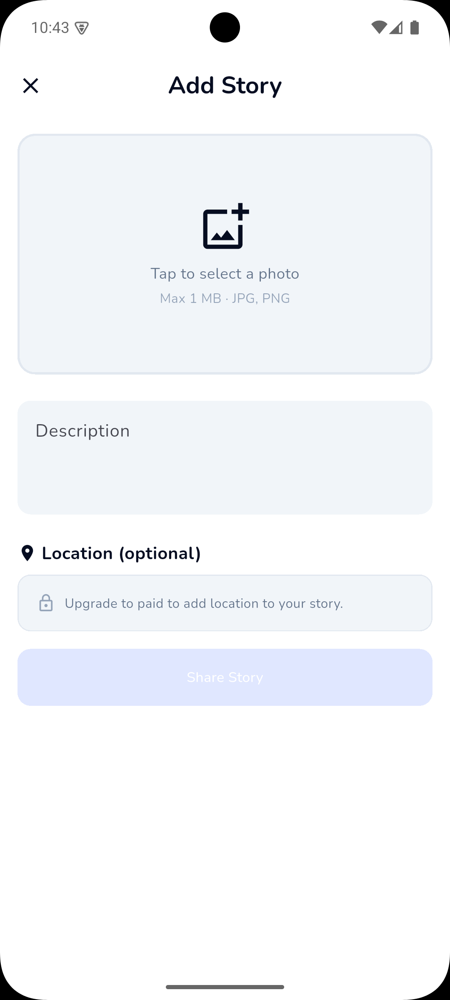 | 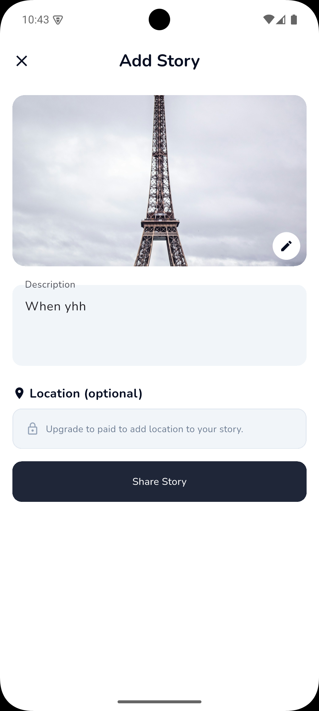 |

### Paid flavor — extra capability

The paid build adds a full-screen map picker and reverse-geocoded address display.

| Filled, no location | Pick a location | Filled, with location |
|:---:|:---:|:---:|
| 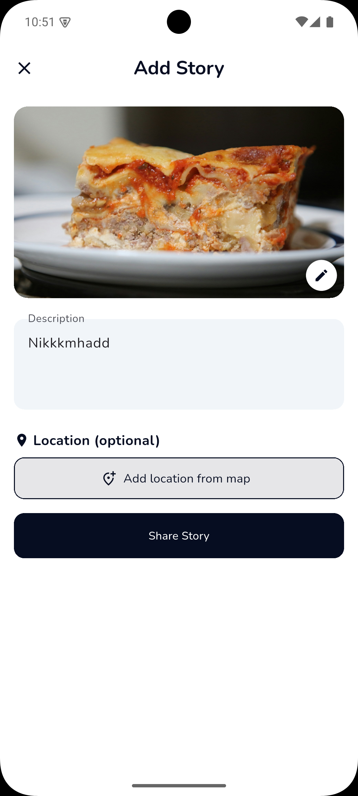 | 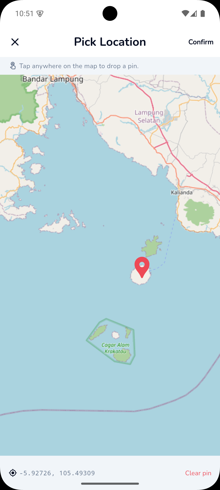 |  |

Story details on the paid build show the map and a reverse-geocoded address:

<p align="center">
  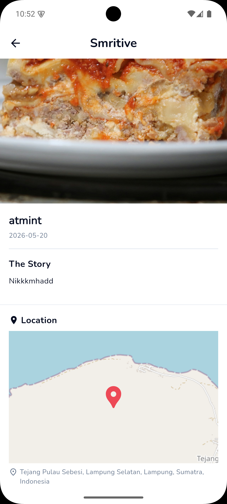
</p>

---

## Tech Stack

| Layer | Choice |
|:---|:---|
| SDK | Dart `^3.11.1`, Flutter (Material 3) |
| Routing | [`go_router`](https://pub.dev/packages/go_router) 17.1 |
| State management | [`provider`](https://pub.dev/packages/provider) 6.1 (`ChangeNotifier`) |
| Networking | [`http`](https://pub.dev/packages/http) 1.2 |
| Persistence | [`shared_preferences`](https://pub.dev/packages/shared_preferences) 2.3 |
| Models | `json_annotation` + `json_serializable` + `build_runner` |
| Media | [`image_picker`](https://pub.dev/packages/image_picker) 1.1 |
| Maps | [`flutter_map`](https://pub.dev/packages/flutter_map) 7.0 + `latlong2` 0.9 |
| Reverse geocoding | OpenStreetMap **Nominatim** (no API key) |
| Localization | `flutter_localizations` + ARB files |
| Theming | Material 3 + [`google_fonts`](https://pub.dev/packages/google_fonts) (Nunito) |

---

## Architecture

Smritive uses a **feature-first** layout with a clean `data → domain → presentation` split per feature. Cross-cutting infrastructure lives under `lib/core/`. Providers come in two scopes: **app-root** (session-wide: `AuthProvider`, `LocaleProvider`, `ApiService`) and **route-scoped** (created in the route builder, disposed when leaving: `LoginProvider`, `RegisterProvider`, `StoryListProvider`, `AddStoryProvider`, `StoryDetailProvider`).

```
lib/
├── main.dart                     # Minimal entry; mounts RootBootstrap
├── core/
│   ├── config/                   # Build-flavor detection (FlavorConfig)
│   ├── data/                     # Cross-cutting repositories (Geocoding)
│   ├── network/                  # Single ApiService (Dicoding API)
│   ├── providers/                # App-root providers (LocaleProvider)
│   ├── router/                   # GoRouter + auth-aware redirects
│   ├── splash/                   # Animated splash + bootstrap orchestrator
│   └── theme/                    # Colors, spacing, text styles, theme
├── features/
│   ├── auth/{data,domain,presentation}
│   └── stories/{data,domain,presentation}
├── l10n/                         # ARB files + generated AppLocalizations
└── shared/widgets/               # ShimmerBox, etc.
```

> **Bootstrap order.** Async initialization (`AuthProvider.create()`, `LocaleProvider.create()`) runs **while the splash is on screen**, not before `runApp`. The splash widget mounts immediately and the providers hydrate in the background. See [`lib/core/splash/root_bootstrap.dart`](lib/core/splash/root_bootstrap.dart).

---

## Project Structure

```
.
├── android/app/src/{main,free,paid}/res/   # Per-flavor Android resources
├── assets/
│   ├── icons/custom/smritive-icon.png      # Source icon (single source of truth)
│   └── readme/                             # Screenshots used by this README
├── lib/                                    # Dart sources (see Architecture)
├── test/                                   # Unit / widget tests
├── tool/gen_icons.ps1                      # Regenerates per-flavor Android icons
├── pubspec.yaml
└── analysis_options.yaml
```

---

## Getting Started

### Prerequisites

- Flutter SDK `^3.11`
- Android Studio with the Android SDK + at least one emulator or a physical device
- PowerShell (Windows) or `pwsh` (cross-platform) — only required if you need to regenerate icons

### Setup

```bash
git clone https://github.com/RivaldoPardede/Smritive
cd smritive
flutter pub get
dart run build_runner build --delete-conflicting-outputs
```

The `build_runner` step generates `*.g.dart` files for `Story` and `LoginResult`.

### Run

```bash
# Paid flavor
flutter run --flavor paid --dart-define=FLAVOR=paid

# Free flavor
flutter run --flavor free --dart-define=FLAVOR=free
```

> **Both flags are required.** The Gradle `--flavor` switch selects the Android resources (icons, app name); the `--dart-define=FLAVOR=...` switch selects the Dart-side `FlavorConfig` (which gates the location feature). They must agree.

---

## Building APKs

```bash
# Free
flutter build apk --flavor free --dart-define=FLAVOR=free

# Paid
flutter build apk --flavor paid --dart-define=FLAVOR=paid
```

Outputs land at `build/app/outputs/flutter-apk/app-{free,paid}-release.apk`. Both APKs install side-by-side because their application IDs differ.

---

## Regenerating Launcher Icons

If you change the source icon at `assets/icons/custom/smritive-icon.png`, regenerate every density for both flavors with:

```powershell
pwsh tool/gen_icons.ps1
```

The script writes 50 PNGs under `android/app/src/{free,paid}/res/{mipmap,drawable}-*/`. It is idempotent. The free flavor is auto-tinted to `#94A3B8`; the paid flavor is the unmodified original. No external dependencies required (uses .NET `System.Drawing`).

---

## Testing

```bash
flutter test
flutter analyze
```

Current test coverage is unit-only — JSON mappers for `LoginResult` and `Story` in `test/widget_test.dart`. Future contributions should add provider tests with a mocked `http.Client`.

---

## Contributing

If you fork or extend Smritive, please follow the existing conventions:

- **Match the patterns**: feature-first layout, `ChangeNotifier` providers, repositories that translate API responses into typed exceptions.
- **Don't suppress errors**. No `// ignore: ...`, no empty `catch` blocks. Fix root causes.
- **New API endpoints** go through `lib/core/network/api_service.dart`. New domain types throw their own `*Exception` subclass.
- **Run `flutter analyze`** before opening a PR. The repo currently reports zero diagnostics; keep it that way.
- **Commit messages** follow [Conventional Commits](https://www.conventionalcommits.org/): `feat:`, `fix:`, `refactor:`, `docs:`, `test:`, `chore:`.

---

## License

Released under the [MIT License](LICENSE). The Smritive name and brand mark are part of the project's identity; the source code itself is freely reusable under MIT.

---

## Acknowledgements

- **Dicoding Indonesia** — for the [Story API](https://story-api.dicoding.dev/v1) and the *Intermediate Flutter* class that motivated this project.
- **OpenStreetMap contributors** — for the map tiles consumed by `flutter_map`.
- **Nominatim** — for free reverse geocoding.
- **Google Fonts** — for the Nunito typeface used throughout the UI.
- **Flutter & Dart teams** — for an SDK that makes shipping like this enjoyable.
